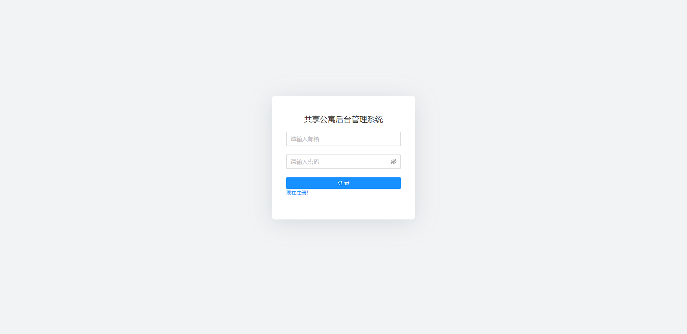
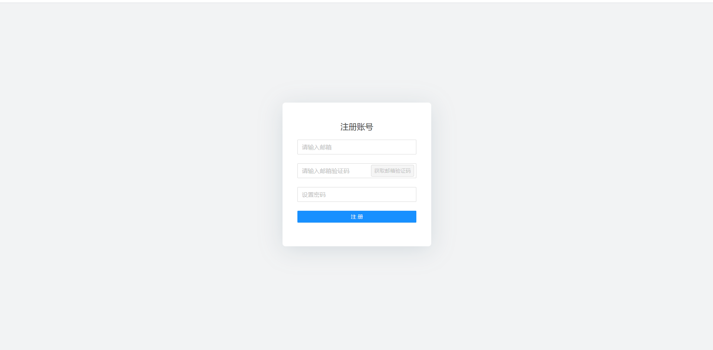
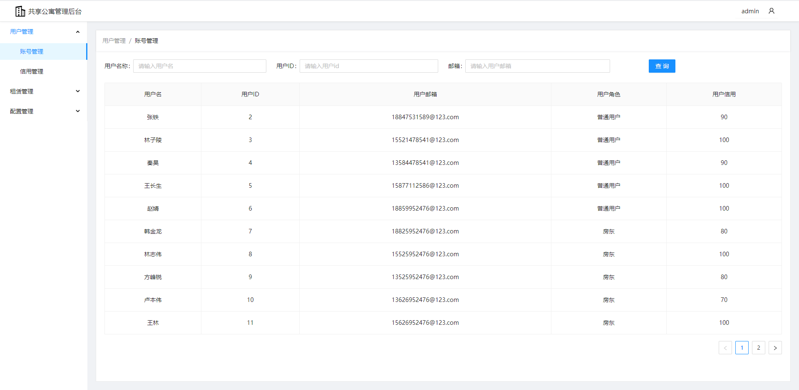
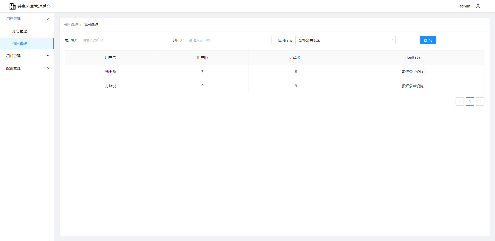
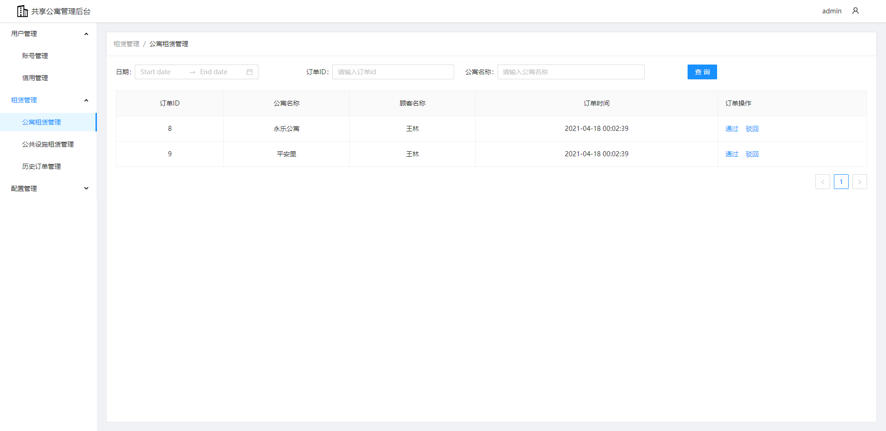
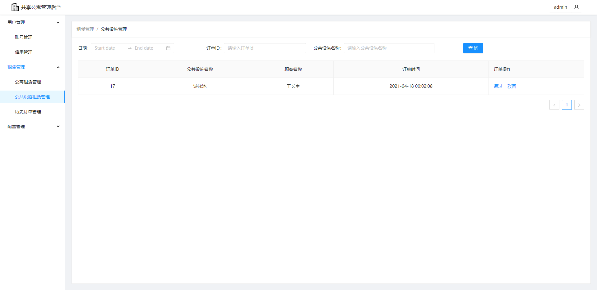
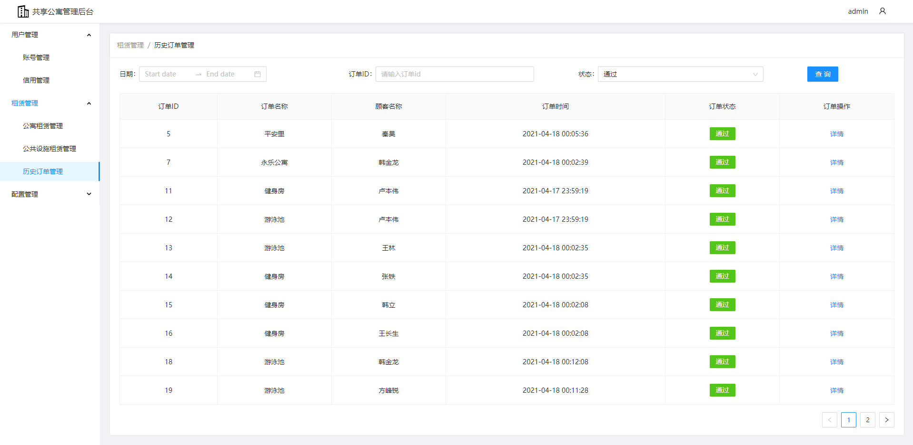
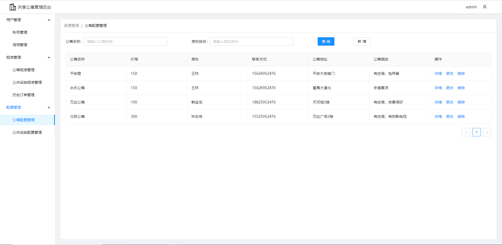
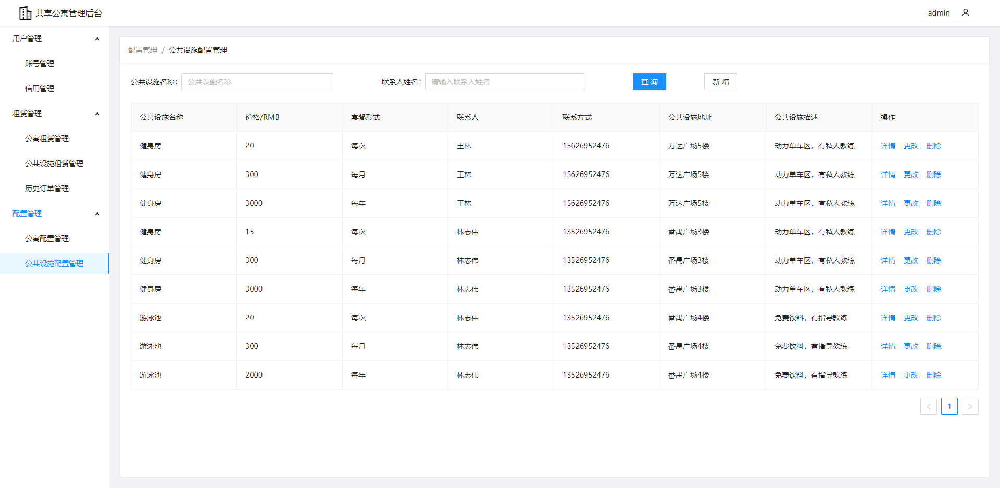

# 共享公寓管理后台(前端)

## 体验

https://yinjiangqaq.com/sharedHouse/#/login

## 使用

克隆项目到本地

```
git clone https://github.com/yinjiangqaq/sharedHouse.git
```

安装依赖并运行项目

```
npm install

npm run start
```

项目会运行在 3000 端口，打开浏览器，地址栏输入：`http://localhost:3000`便可看到我们的项目

## 技术栈

React Hooks + ant design + axios

## 功能列表

- 管理员的登陆注册

- 用户管理
  > 账号管理
  >
  > 信用管理

* 租赁管理

  > 公寓租赁管理
  >
  > 公共设施租赁管理
  >
  > 历史订单管理

* 配置管理
  > 公寓配置管理
  >
  > 公共设施配置管理

## 项目截图

- 管理员的登录
  
- 管理员的注册
  

* 账号管理
  
* 信用管理
  
* 公寓租赁管理
  
* 公共设施租赁管理
  
* 历史订单管理
  
* 公寓配置管理
  
* 公共设施配置管理
  
